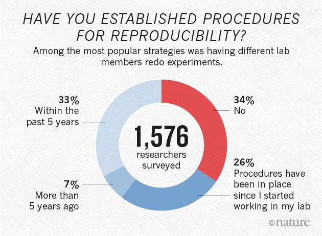
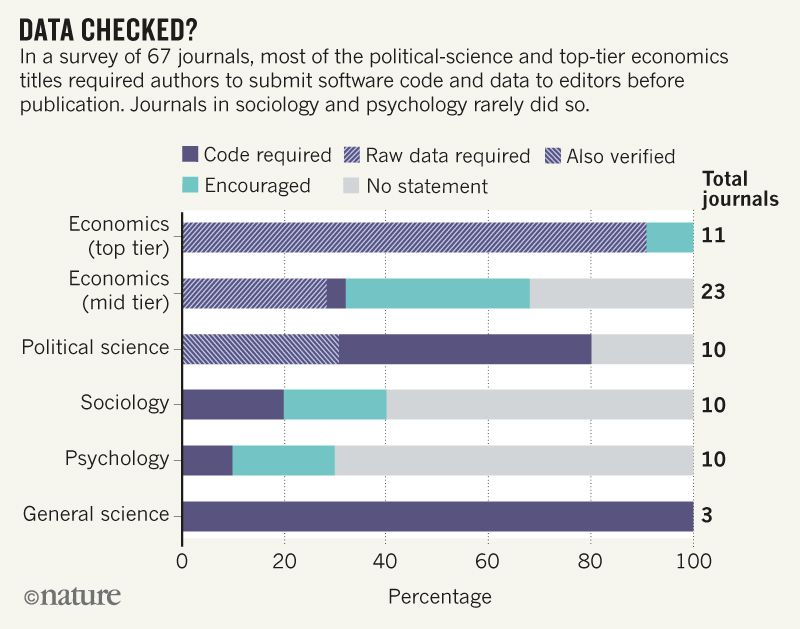
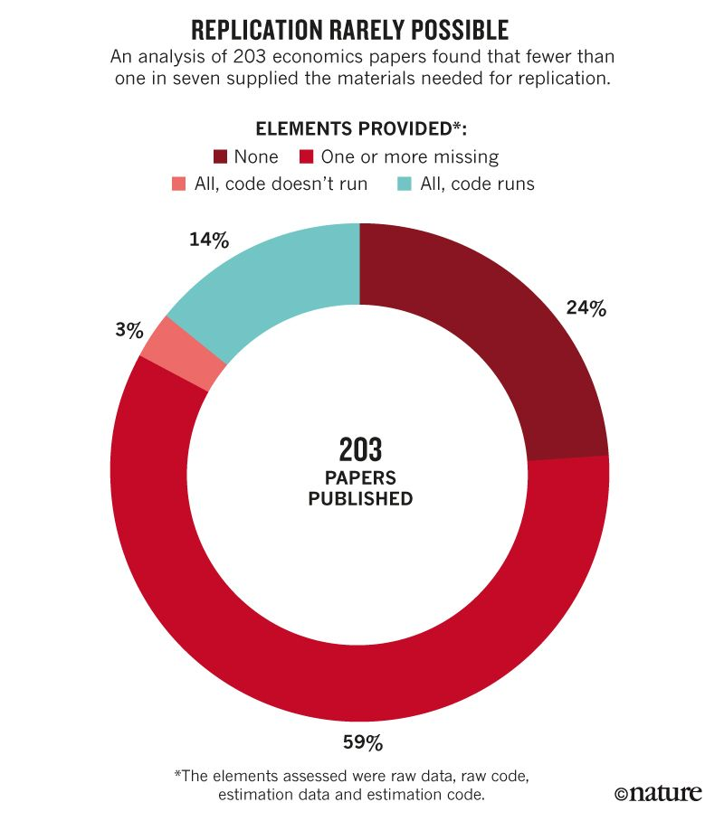
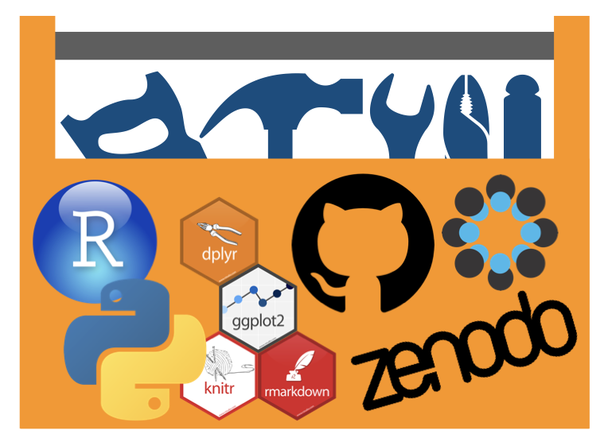
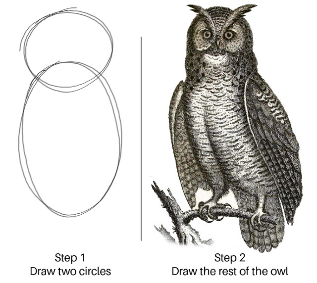
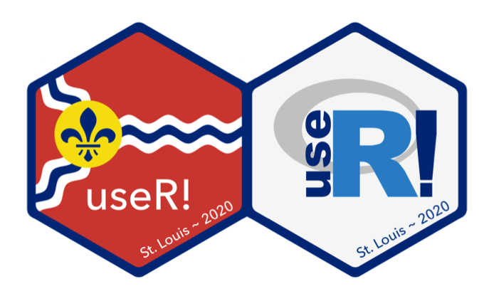

```{r include=FALSE}
emojifont::load.fontawesome()
```


# Introductions!

**Chris Prener, Ph.D.** is a mixed methods sociologist at SLU who studies issues affecting first responders and neighborhoods. He uses computational tools for processing large administrative and spatial data sets.

You can contact Chris at:
* Email - [chris.prener@slu.edu](mailto:chris.prener@slu.edu)
* Web - https://chris-prener.github.io
* Twitter - [@chrisprener](http://twitter.com/chrisprener)

<br>

**Matt Schuelke, Ph.D.** is a senior statistician in the Office of the Vice President for Research as well as adjunct faculty in the Center for Health Outcomes Research (SLUCOR) at SLU.

You can contact Matt at:
* Email - [matthew.schuelke@slu.edu](mailto:matthew.schuelke@slu.edu)
* Web - https://www.themadstatter.com

---

# The State of Academic Research

Woelfle, Olliaro, and Todd (2011): 

> Academia is associated with the free transmission of data and resources, but in many ways this is no longer how it operates. The scientific community generally works towards common goals by competition between closed groups of scientists and communicates research results through publications relying on pre-publication peer-review. Papers frequently omit some experimental information, or ignore negative results. The delays involved in publication of papers, or reviewing of grants are significant.

---

# The Replication "Crisis"

```{r add-replication-img-1, echo=FALSE, out.width = "80%", fig.align = "center"}
knitr::include_graphics("assets/Baker_2016_1.jpeg")
```

---

# Uneven Responses to the Replication "Crisis"

```{r add-replication-img-2, echo=FALSE, out.width = "90%", fig.align = "center"}

```

---

# Uneven Responses to the Replication "Crisis"

```{r add-replication-img-3, echo=FALSE, out.width = "80%", fig.align = "center"}

```

---

# Uneven Responses to the Replication "Crisis"

```{r add-replication-img-4, echo=FALSE, out.width = "60%", fig.align = "center"}

```

---

# Public Access Pressures on PIs

* In 2003, NIH adopted a formal policy on sharing research data:

> Expects investigators seeking more than $500K in direct support in any given year to submit a data sharing plan with their application or to indicate why data sharing is not possible.	

* NIH also expects publications to be submitted to PubMed Central upon publication.
* NSF also has policies on sharing data and software from funded work:

> b.	Investigators are expected to share with other researchers, at no more than incremental cost and within a reasonable time, the primary data, samples, physical collections and other supporting materials created or gathered in the course of work under NSF grants. Grantees are expected to encourage and facilitate such sharing.

> c.	Investigators and grantees are encouraged to share software and inventions created under the grant or otherwise make them or their products widely available and usable.

---

# Open Science to the Rescue?

One problem is that we do not have a cohesive definition of open science. Is it publishing data online? Providing code? Something else?

--

</br>

Gertler, Galiani, and Romero (2018):

> We were able to replicate only a small minority of these papers. Overall, of the 203 studies, 76% published at least one of the 4 files required for replication: the raw data used in the study (32%); the final estimation data set produced after data cleaning and variable manipulation (60%); the data-manipulation code used to convert the raw data to the estimation data (42%, but only 16% had both raw data and usable code that ran); and the estimation code used to produce the final tables and figures (72%).

---

# Open Science to the Rescue!

Possible elements:

1. the raw data used in the study
2. the final estimation data set produced after data cleaning and variable manipulation
3. the data-manipulation code used to convert the raw data to the estimation data
4. the estimation code used to produce the final tables and figures

---

# Open Science to the Rescue!

Possible elements:

1. **pre-registered hypotheses**
2. **protocols and research materials**
3. **research logs**
4. the raw data used in the study
5. the final estimation data set produced after data cleaning and variable manipulation
6. the data-manipulation code used to convert the raw data to the estimation data
7. the estimation code used to produce the final tables and figures

---

# Open Science to the Rescue!

Possible elements:

1. pre-registered hypotheses
2. protocols and research materials
3. research logs
4. the raw data used in the study
5. the final estimation data set produced after data cleaning and variable manipulation
6. **the data-manipulation code used to convert the raw data to the estimation data**
7. **the estimation code used to produce the final tables and figures**
8. **all code should run on any computer**

---

# What is open source software?

From ["The WIRED Guide to Open Souce Software"](https://www.wired.com/story/wired-guide-open-source-software/):

> The open source software movement grew out of the related, but separate, "free software" movement. In 1983, Richard Stallman, at the time a programmer at the MIT Artificial Intelligence Laboratory, said he would create a free alternative to the Unix operating system, then owned by AT&T; Stallman dubbed his alternative GNU, a recursive acronym for "GNU's Not Unix."

> For Stallman, the idea of "free" software was about more than giving software away. It was about ensuring that users were free to use software as they saw fit, free to study its source code, free to modify it for their own purposes, and free to share it with others. Stallman released his code under a license known as the GNU Public License, or GPL, which guarantees users those four software freedoms. The GPL is a "viral" license, meaning that anyone who creates software based on code licensed under the GPL must also release that derivative code under a GPL license.

---

# Open Science to the Rescue!

Possible elements:

1. pre-registered hypotheses
2. protocols and research materials
3. research logs
4. the raw data used in the study
5. the final estimation data set produced after data cleaning and variable manipulation
6. **the data-manipulation code used to convert the raw data to the estimation data**
7. **the estimation code used to produce the final tables and figures**
8. **all code should run on any computer**

---

# Open Science to the Rescue!

Possible elements:

1. pre-registered hypotheses
2. protocols and research materials
3. research logs
4. the raw data used in the study
5. the final estimation data set produced after data cleaning and variable manipulation
6. the data-manipulation code used to convert the raw data to the estimation data
7. the estimation code used to produce the final tables and figures
8. all code should run on any computer
9. **all of the above materials should be available online in a format that makes them cite-able**

---

# What is a DOI?

From the [University of Illinois-Chicago](https://library.uic.edu/help/article/1966/what-is-a-doi-and-how-do-i-use-them-in-citations/):

> A DOI, or Digital Object Identifier, is a string of numbers, letters and symbols used to permanently identify an article or document and link to it on the web. A DOI will help your reader easily locate a document from your citation. Think of it like a Social Security number for the article you’re citing — it will always refer to that article, and only that one.

---

# Open Science to the Rescue!

Possible elements:

1. pre-registered hypotheses
2. protocols and research materials
3. research logs
4. the raw data used in the study
5. the final estimation data set produced after data cleaning and variable manipulation
6. the data-manipulation code used to convert the raw data to the estimation data
7. the estimation code used to produce the final tables and figures
8. all code should run on any computer
9. **all of the above materials should be available online in a format that makes them cite-able**

---

# Open Science to the Rescue!

Possible elements:

1. pre-registered hypotheses
2. protocols and research materials
3. research logs
4. the raw data used in the study
5. the final estimation data set produced after data cleaning and variable manipulation
6. the data-manipulation code used to convert the raw data to the estimation data
7. the estimation code used to produce the final tables and figures
8. all code should run on any computer
9. all of the above materials should be available online in a format that makes them cite-able
10. **results are available without pay wall**

---

# What is Pre-Print?

From [PLOS](https://www.plos.org/why-preprint):

> A preprint is a version of a scientific manuscript posted on a public server prior to formal peer review. As soon it's posted, your preprint becomes a permanent part of the scientific record, citable with its own unique DOI.

> Preprints allow you to share your results when you’re ready -- whether you’re researching an emergent disaster, applying for a grant, or just excited to broadcast your work to a wider audience.

---

# Open Science to the Rescue!

Possible elements:

1. pre-registered hypotheses
2. protocols and research materials
3. research logs
4. the raw data used in the study
5. the final estimation data set produced after data cleaning and variable manipulation
6. the data-manipulation code used to convert the raw data to the estimation data
7. the estimation code used to produce the final tables and figures
8. all code should run on any computer
9. all of the above materials should be available online in a format that makes them cite-able
10. **results are available without pay wall**

---

# An Open Science Toolkit

```{r add-toolbox, echo=FALSE, out.width = "90%", fig.align = "center"}

```

---

# How do we do this?

1. Use open source software languages like `R` or Python for as much of your data wrangling and analysis workflow as possible.

---

# How do we do this?

1. Use open source software languages like `R` or Python for as much of your data wrangling and analysis workflow as possible.
2. **Use GitHub or GitLab to store, share, and track changes to analysis data code using Git, a version control software package.**

---

# How do we do this?

1. Use open source software languages like `R` or Python for as much of your data wrangling and analysis workflow as possible.
2. Use GitHub or GitLab to store, share, and track changes to analysis data code using Git, a version control software package.
3. **Use the Open Science Framework (OSF) for:**
    * **pre-registration**
    * **cataloging all research materials (it can link back to your GitHub repository)**
    * **creating a DOI number to make work cite-able**
    * **publish pre-prints of findings**

---

# How do we do this?

1. Use open source software languages like `R` or Python for as much of your data wrangling and analysis workflow as possible.
2. Use GitHub or GitLab to store, share, and track changes to analysis data code using Git, a version control software package.
3. Use the Open Science Framework (OSF) for:
    * pre-registration
    * cataloging all research materials (it can link back to your GitHub repository)
    * creating a DOI number to make work cite-able
    * publish pre-prints of findings
4. **If you want to make data cite-able independent of a single project, use Zenodo or another service that creates DOI numbers specifically for data sets.**

---

# It Isn't That Easy, Of Course...

```{r add-owl, echo=FALSE, out.width = "70%", fig.align = "center"}

```

---

# What We're All About

We're in our **seventh semester** of offering seminars on using `R` for data science.

<br>

We were founded in **2015** by Chris, Christy Garcia and Kelly Lovejoy.

<br>

We are a **collaborative, interdisciplinary** group at Saint Louis University focused on **building community** around open source software and open science.

<br>

Current faculty board members are: Chris, Christy (LLC), Kelly (LLC), Matt, Darrin Speegle (Math/Stat), Jill Waring (Psych), Cort Rudolph (Psych), Srikanth Mudigonda (SPS)

---

# What We're All About

We `r emojifont::emoji('heart')` `R`, RStudio, open data, and open science!

--

<br>

Our seminars cover *most* of data science workflow from Wickham and Grollman (2016):

```{r add-workflow-image, echo=FALSE}
knitr::include_graphics("assets/workflow.png")
```

---

# Upcoming Events

### DSS 08: Data Visualization in `R`

* Session 02 - Septemeber 18th
* Session 03 - October 2nd
* Session 04 - October 16th

*All sessions are in 3600 Morrissey from 1pm-2pm*

--

### Other DSS Events this Fall

* Brownbag, Git and GitHub - September 12th (**tomorrow!!**)
* Brownbag, Open Science Framework - October 10th

*Both sessions are in 3600 Morrissey from 2:15pm-3:45pm*

---

# GitHub

We host all of our materials on GitHub. If you want to get back to the lesson materials later, head to [https://github.com/slu-dss](https://github.com/slu-dss) and look in each of the repositories (a special type of folder) for our teaching materials.

<br>

This is one way we promote equity and inclusion in data science - you do not need to attend our sessions, or even be at SLU or in St. Louis, to learn from us and use these open science techniques in your own work.

---

# useR! 2020
July 7-10, Marriott St. Louis Grand

```{r add-useR-image, echo=FALSE}

```

---
class: inverse, center, middle

# Thank You for Coming!
